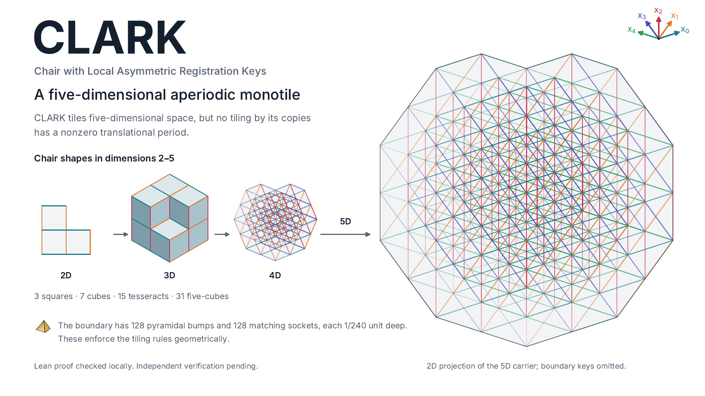

# The CLARK Tile: An Aperiodic Monotile in Five Dimensions

Conor Grogan, author and responsible maintainer

We call the five-dimensional construction **CLARK**, for **Chair with Local Asymmetric Registration Keys**. It retains the Lean identifier **T5**.

Projection of the carrier; boundary keys omitted. Illustration does not replace exact shape specification.

[Download the CLARK tile illustration (PDF)](Clark_5D_tile.pdf)

We give an explicit compact tile in five-dimensional Euclidean space and prove that it admits tilings but no periodic tiling. The construction modifies a chair made from 31 unit five-cubes with 256 rational pyramidal keys. Copies may be translated, rotated, or reflected. The theorem states that every tiling by these copies has no nonzero translation preserving its tile collection. The Lean formalization fixes the exact body and proves compactness, existence, and aperiodicity without assuming lattice registration or matching rules.

## Proof and verification status

The complete theorem, its exact compact-body binding, and the actual Solution have passed local Lean **4.35.0-rc2** checks. The audited theorem depends only on `propext`, `Classical.choice`, and `Quot.sound`.

**The required [full Palomar reusable-workflow mechanical preflight](https://github.com/jconorgrogan/palomar-chair-verification/actions/runs/37509737027) completed with a Comparator rejection:** the canonical Challenge and Solution exports disagree on the generated helper proof `PalomarMonotiles.tangentIndex._proof_4`. The clean Solution build completed successfully (4,135 Lake jobs); source requirements, canonical Challenge provenance, and both exports passed. The independent kernels were not reached. We are diagnosing the mismatch and preparing a source correction for a fresh full preflight. This repository does not yet claim a full mechanical pass, Palomar review, or registry acceptance. The earlier private cold-build run was cancelled when switching to the required public preflight; its 458 successful build targets are partial evidence, not a completed independent check.

The selected result is `PalomarMonotiles.T5_isAperiodicMonotile`. The independent Challenge fixes the exact shape and the physical tiling statement; the Solution proves that statement without importing Challenge. The Comparator has no definition exemptions.

## Exact source snapshot

The complete source is on [the T5 verification branch](https://github.com/jconorgrogan/palomar-chair-verification/tree/verification/palomar-full-20261006), frozen at commit [`68e28dd1ae9472fc92a8af87b666501c17aa7675`](https://github.com/jconorgrogan/palomar-chair-verification/tree/68e28dd1ae9472fc92a8af87b666501c17aa7675).

- [Full mathematical account and reproduction instructions](https://github.com/jconorgrogan/palomar-chair-verification/blob/68e28dd1ae9472fc92a8af87b666501c17aa7675/README.md)
- [Independent Challenge](https://github.com/jconorgrogan/palomar-chair-verification/blob/68e28dd1ae9472fc92a8af87b666501c17aa7675/Challenge.lean) and [actual Solution](https://github.com/jconorgrogan/palomar-chair-verification/blob/68e28dd1ae9472fc92a8af87b666501c17aa7675/Solution.lean)
- [Structured metadata, source relationships, automation and review account](https://github.com/jconorgrogan/palomar-chair-verification/blob/68e28dd1ae9472fc92a8af87b666501c17aa7675/formalization.yaml)
- [Exact source manifest](https://github.com/jconorgrogan/palomar-chair-verification/blob/68e28dd1ae9472fc92a8af87b666501c17aa7675/SOURCE_MANIFEST.json)
- [Verification runs](https://github.com/jconorgrogan/palomar-chair-verification/actions)

The source manifest has SHA-256 `2007b9f2692b40d098b7005d43c04e6feb6cb1039c3c812ef952dd97b8edb521`. The full source contains the substantive proof development, not only a theorem wrapper. The `main` branch serves as this public index and retains its earlier history.

## Companion work

This submission formalizes the 5D construction. Companion work gives an ordinary computer-assisted proof for the seven-dimensional construction (T7) and a hierarchy theorem for registered chair matching rules in every odd-prime dimension. Those results are outside the selected T5 verification. This entry does not establish physical monotiles in every odd-prime dimension. The exact distinctions and retained source citations are in the [full mathematical account](https://github.com/jconorgrogan/palomar-chair-verification/blob/68e28dd1ae9472fc92a8af87b666501c17aa7675/README.md#broader-program).

## Production, review and license

AI systems made substantive contributions to mathematical analysis, Lean proofs, exact certificate generation, audits, migration and exposition. The metadata records those contributions separately from human authorship. No independent human mathematical peer review or novelty certification is claimed.

The proof repository is licensed under [Apache License 2.0](https://github.com/jconorgrogan/palomar-chair-verification/blob/68e28dd1ae9472fc92a8af87b666501c17aa7675/LICENSE). Lean, Mathlib and other dependencies retain their own licenses and notices.

An [earlier four-result compatibility pilot](https://github.com/jconorgrogan/palomar-chair-verification/actions/runs/37466588417) passed the official Comparator and three kernels. That result concerns four supporting statements and is separate from the full T5 preflight.
